# Task 1: Platform Copyright Policy Analysis

## Platform: YouTube

### Overview of YouTube's Copyright Management System

YouTube employs a three-tiered copyright protection system designed to balance the needs of copyright holders, content creators, and viewers. This system includes automated detection technology, manual reporting tools, and a comprehensive dispute resolution process.

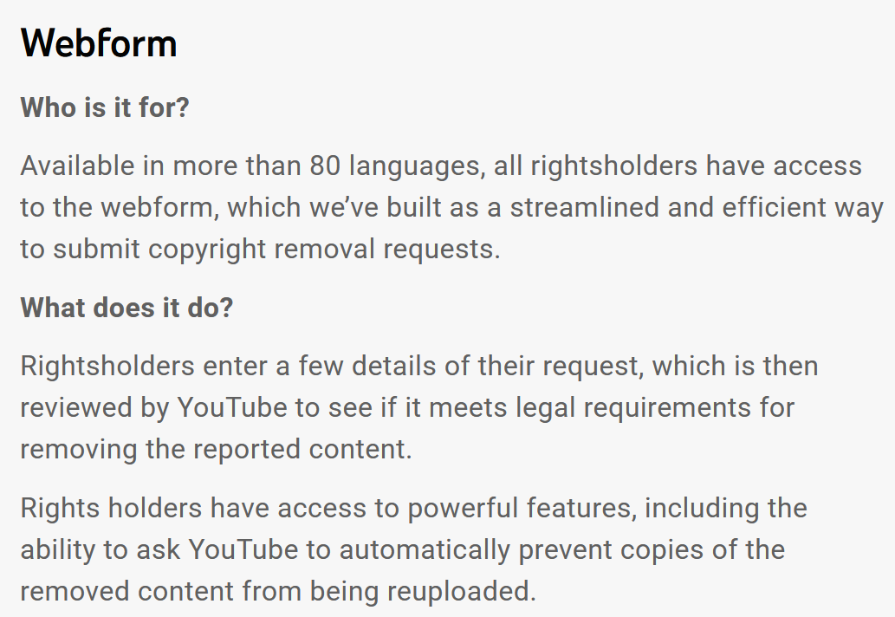
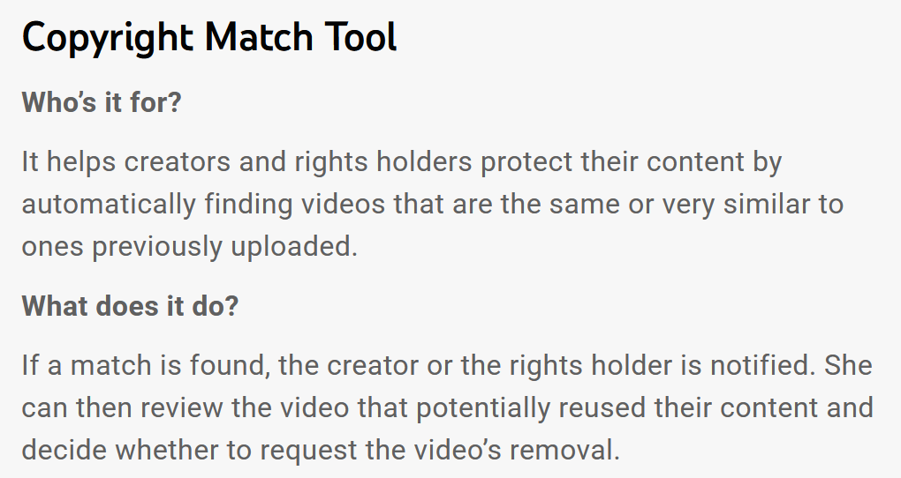
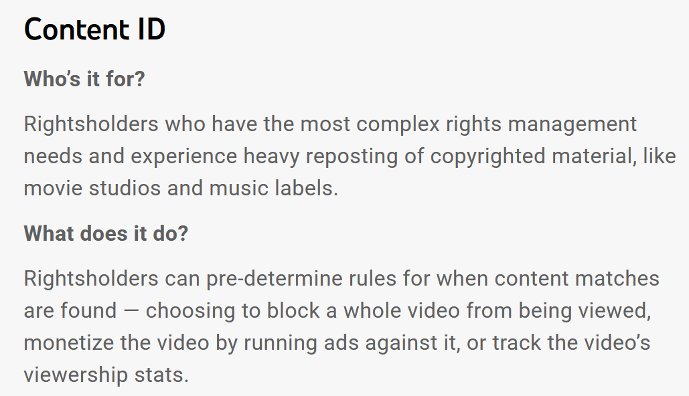

### Copyright Detection Methods

YouTube uses multiple tools for copyright detection, each serving different types of rightsholders:

#### 1. Content ID (Automated System)

**Who can use it:** Major copyright holders with exclusive rights to substantial bodies of original content that is frequently reuploaded (movie studios, music labels, major publishers)

**How it works:**
- Rightsholders provide reference files (audio, visual, or audiovisual) to YouTube
- Content ID creates a digital fingerprint of the copyrighted material
- Every video uploaded to YouTube is automatically scanned against this database
- Matching occurs in real-time during the upload process, before videos are published
- The system can detect matches even in modified content (different quality, cropped, with overlays)

**Accuracy:** According to YouTube, Content ID processes hundreds of millions of videos and identifies matches with high precision, though it primarily detects exact or near-exact copies rather than transformative uses.

#### 2. Copyright Match Tool

**Who can use it:** Regular creators and smaller rightsholders who don't qualify for Content ID

**How it works:**
- Automatically finds videos that are the same or very similar to previously uploaded content
- Less sophisticated than Content ID - looks for identical reuploads rather than partial matches
- Notifies the creator when potential matches are found
- Creator can then review and request removal if appropriate

#### 3. Copyright Webform (Manual Reporting)

**Who can use it:** Any copyright holder (available in 80+ languages)

**How it works:**
- Rightsholders manually submit copyright removal requests via web form
- YouTube reviews submissions to verify they meet legal requirements
- Used for one-off violations or by smaller copyright holders
- Provides option to prevent automatic reuploads of removed content

### What Happens When Content Is Flagged

When copyrighted content is detected, the outcome depends on the copyright holder's pre-set preferences and the method of enforcement:

#### Content ID Claim Options:

1. **Block** - Video cannot be viewed in specified territories
2. **Monetize** - Ads run on the video, revenue goes to copyright holder (may be shared with uploader)
3. **Track** - Copyright holder receives viewership statistics but takes no action

**Geographic Flexibility:** Actions can be territory-specific. A video might be monetized in the US but blocked in Europe, for example.

#### Copyright Strikes (DMCA Takedowns):

Unlike Content ID claims, copyright strikes are serious penalties that result from formal DMCA takedown notices. YouTube's strike system works as follows:

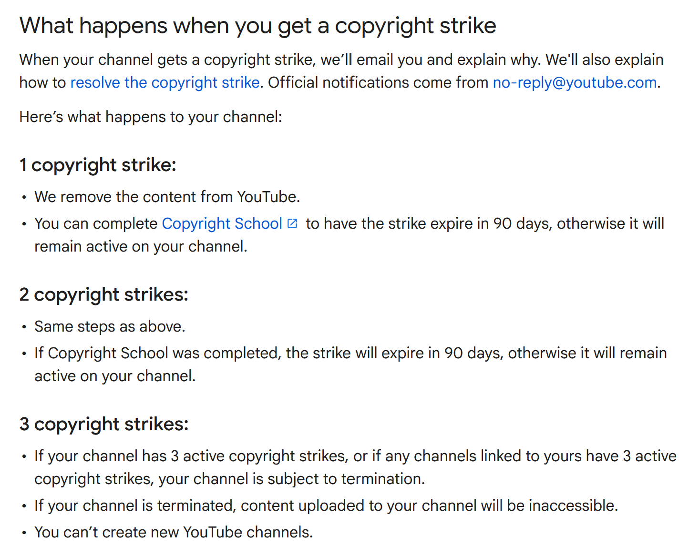

**1 Copyright Strike:**
- Content is removed from YouTube
- Strike can expire in 90 days if creator completes Copyright School
- Otherwise, strike remains active on the channel
- Notification sent via email from no-reply@youtube.com

**2 Copyright Strikes:**
- Same process as first strike
- Two active strikes significantly limit channel functionality
- Strikes expire after 90 days if Copyright School is completed

**3 Copyright Strikes:**
- **Channel termination** - permanent ban
- All content becomes inaccessible
- Cannot create new YouTube channels
- Applies to linked channels as well

**Important Distinction:**
- **Content ID Claim** ≠ **Copyright Strike**
- Claims don't penalize the channel or count toward termination
- Strikes are more severe and come from formal DMCA complaints
- Most copyright enforcement happens through Content ID claims, not strikes

### Appeals and Counter-Notification Process

YouTube provides a multi-step dispute process for creators who believe their content was incorrectly flagged:

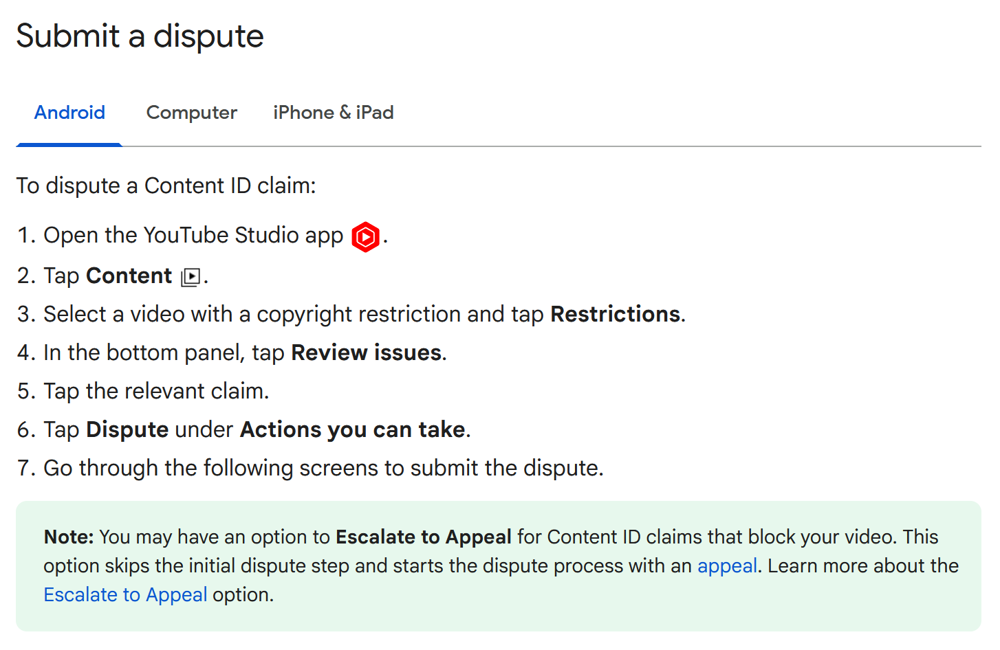

#### Disputing a Content ID Claim:

**Step 1: Initial Dispute**
1. Open YouTube Studio app
2. Navigate to Content tab
3. Select video with copyright restriction
4. Tap "Restrictions" in bottom panel
5. Select "Review issues"
6. Tap the relevant claim
7. Tap "Dispute" under "Actions you can take"
8. Follow prompts to submit dispute

**Dispute Reasons:**
- Fair use or fair dealing
- Content is licensed to you
- Content is in public domain
- Content is your original creation
- Other technical reasons

**Step 2: Copyright Holder Review (30 days)**

Once disputed, the copyright holder has several options:
- **Release the claim** - Dispute succeeds, restrictions removed
- **Uphold the claim** - Dispute denied, claim remains
- **Issue copyright strike** - Escalates to DMCA takedown (rare)
- **No response** - Claim automatically released after 30 days

**Step 3: Appeal (if available)**

For Content ID claims that block videos, creators may see an "Escalate to Appeal" option that skips the initial dispute and goes straight to an appeal. This option:
- Is only available for claims that block content
- Starts the dispute process at a higher level
- Still requires copyright holder response

**Step 4: Counter-Notification (for strikes)**

If a copyright strike is issued, creators can file a DMCA counter-notification claiming the content was removed in error. This is a legal process with potential consequences:
- Must provide legal justification
- Copyright holder has 10-14 business days to file legal action
- If no legal action is taken, content is restored and strike removed
- Filing false counter-notification can result in legal liability

**Statistics:** Between July-December 2023, fewer than 1% of Content ID claims were disputed, and over 65% of disputes succeeded (either through voluntary release or no response from claimant).

### Monetization of Copyrighted Content

YouTube's monetization system for copyrighted content is sophisticated:

**Default Behavior:**
- Copyright holder receives 100% of ad revenue when they monetize a claim
- Uploader receives no revenue unless the copyright holder opts to share

**Revenue Sharing:**
- Some copyright holders choose to share revenue with uploaders
- Split percentage is determined by the copyright holder
- Common in music industry for cover songs

**Multiple Claims:**
- If a video contains multiple copyrighted elements (e.g., background music + movie clip), multiple claimants may receive portions of revenue
- YouTube automatically divides revenue based on claimed content

### Special Programs and Partnerships

#### Content ID Partnerships:

**Eligibility Requirements:**
- Must own exclusive rights to substantial body of original content
- Content must be frequently uploaded by YouTube community
- Must meet YouTube's usage guidelines

**Benefits:**
- Automated protection at scale
- Detailed analytics on content usage
- Flexible policy options (block/monetize/track)
- Territory-specific controls
- Access to YouTube's Content Manager tools

**Accountability:**
- YouTube monitors Content ID use
- Partners who make repeated erroneous claims can lose access
- Partnership can be terminated for guideline violations

### Comparison: Stated Policy vs. Observed Behavior

Based on experiments conducted in Tasks 2 and 3, YouTube's copyright system performs largely as documented, with some notable observations:

#### Consistency with Policy:

**Detection Speed (confirmed):**
- Both copyrighted videos (music and film) were flagged during upload, before publication
- Detection occurred within seconds, demonstrating the real-time scanning capability advertised

**Different Enforcement Actions (confirmed):**
- Music clip (Burna Boy) → Geographic blocking
- Film clip with commentary (Catch Me If You Can) → Allowed with claim
- This demonstrates the policy-based system where copyright holders pre-determine responses

**No Channel Penalties (confirmed):**
- Neither Content ID claim resulted in a copyright strike
- Channel status remained unaffected, as stated in YouTube's policy

#### Gaps and Limitations Observed:

**1. Transformative Use Detection:**
- **Policy:** Content ID is an automated matching system
- **Reality:** System flagged transformative commentary video immediately, even though it added significant educational value
- **Gap:** Content ID doesn't evaluate fair use or transformativeness - it only detects matches and applies the copyright holder's policy. This means fair use determinations are made by copyright holders (who may not understand fair use) rather than by legal standards.

**2. AI-Generated Content:**
- **Policy:** No specific policy mentioned for AI-generated copyrighted characters
- **Reality:** AI-generated Mickey Mouse image passed all copyright checks with "No issues found"
- **Gap:** Content ID is trained on existing copyrighted files, not on recognizing copyrighted characters/designs. New depictions of copyrighted IP are not detected, creating a significant enforcement blind spot.

**3. Visual vs. Audio Detection:**
- **Observation:** Audio matching (Burna Boy song) led to blocking
- **Observation:** Visual matching (movie clip) led to claim but no blocking
- **Analysis:** Music industry appears to set more restrictive policies than film studios, possibly due to higher reupload frequency and clearer market substitution concerns

**4. Dispute Success Rate:**
- **Policy:** System is designed to be fair to both parties
- **Reality:** 65% dispute success rate suggests either: (a) many claims are overly broad, or (b) copyright holders often don't respond to disputes, effectively allowing reuse
- **Implication:** The system may favor copyright holders initially, but provides effective recourse for legitimate uses

**5. Claim vs. Strike Distinction:**
- **Policy:** Content ID claims are separate from copyright strikes
- **Reality:** Both experiments resulted in claims, not strikes, confirming the system is designed to handle most copyright issues without penalties
- **Analysis:** The 3-strike system serves as a deterrent for repeat offenders and manual infringement, while Content ID handles automated enforcement without punishing creators

### Key Takeaways:

1. **Automation is comprehensive but imperfect:** Content ID catches reproductions effectively but doesn't understand context, transformativeness, or fair use.

2. **Policy flexibility creates inconsistency:** Different copyright holders set different policies, meaning identical uses of content might be treated differently depending on who owns the rights.

3. **System favors copyright holders initially:** Burden is on uploader to dispute, and claims can remain even on transformative content if the holder chooses to enforce.

4. **Strikes are reserved for serious violations:** The distinction between claims and strikes shows YouTube attempts to balance protection with creator-friendliness, using strikes only for DMCA takedowns.

5. **Emerging technologies create gaps:** AI-generated content depicting copyrighted characters evades detection entirely, suggesting the system isn't equipped for derivative works that don't directly copy existing files.

6. **Appeals process is functional:** High dispute success rate suggests the system does provide meaningful recourse, though it requires uploader initiative and knowledge of their rights.

# Task 2: Fair Use Experiments

## Experiment 1: Raw Copyrighted Clip (Minimal Fair Use)

### Description
Uploaded a 16-second unedited audio clip of "Last Last" by Burna Boy with a static image of the artist. No commentary, transformation, or additional creative content was added.

**Content:** Raw audio from copyrighted song  
**Duration:** 0:16  
**Transformativeness:** None - purely reproductive use  
**Upload Time:** Dec 11, 2025  

### Results

**Detection:** Immediate (flagged during upload process before publication)

**Outcome:** Partially blocked
- Content ID claim by copyright owner
- Video blocked in certain geographic regions
- No copyright strike issued to channel
- Video remains viewable in some territories

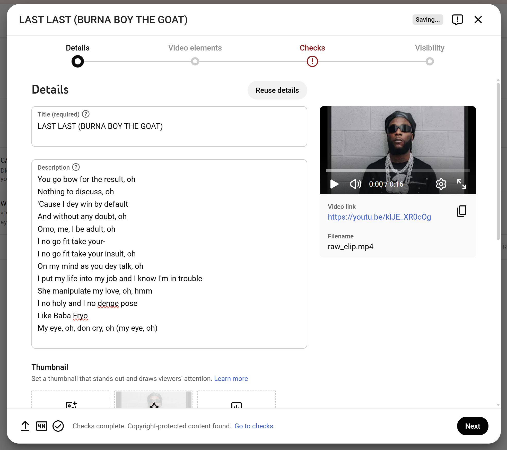
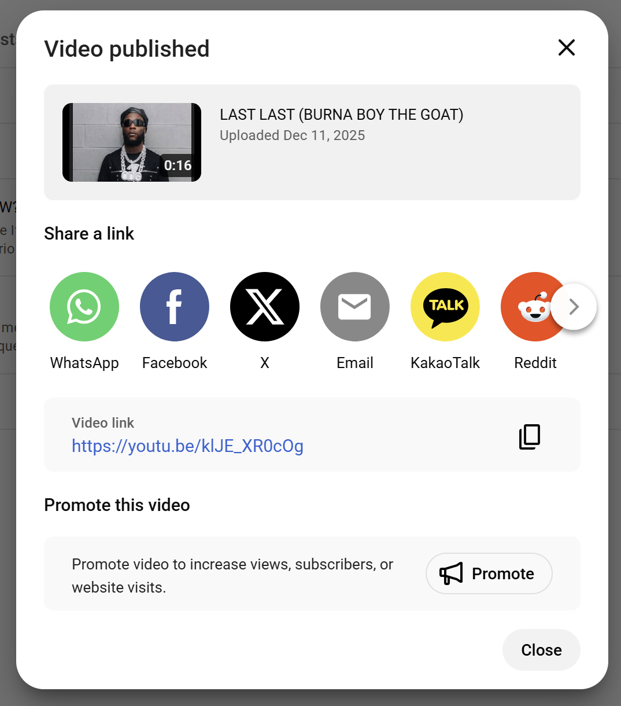
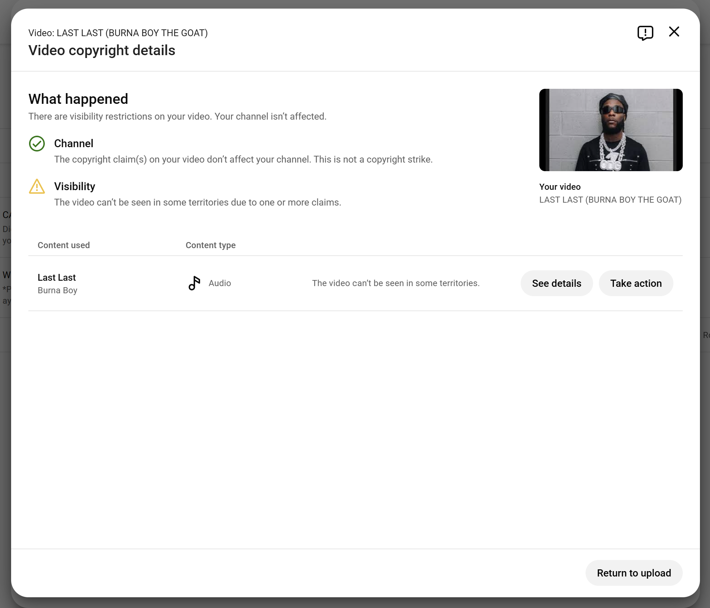
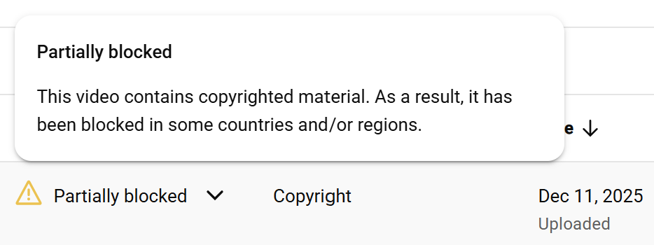

**Platform Action:**
- YouTube's Content ID immediately identified "Last Last" by Burna Boy
- Copyright holder chose to block video in specific territories
- Message: "The video can't be seen in some territories due to one or more claims"
- Channel status: Not affected (this is not a copyright strike)

---

## Experiment 2: Commentary/Educational Use (Transformative Fair Use)

### Description
Uploaded a 40-second video containing footage from "Catch Me If You Can" (2002) with original voice-over commentary. The video discusses a notable detail about the film - specifically, that the French police officer who arrests Leonardo DiCaprio's character is played by the real Frank Abagnale Jr., creating a meta moment where "the real con man is literally the one catching himself."

**Content:** Movie footage + original educational commentary  
**Duration:** 0:40  
**Transformativeness:** High - added original analysis and educational context  
**Recording Method:** Phone camera recording of laptop screen (due to DRM restrictions on screen recording)  
**Upload Time:** Dec 11, 2025  

### Results

**Detection:** Immediate (flagged during upload process)

**Outcome:** Allowed with copyright claim
- Content ID claim detected copyrighted content
- Copyright owner chose to allow the video to remain published
- No blocking or muting applied
- Video fully accessible in all regions

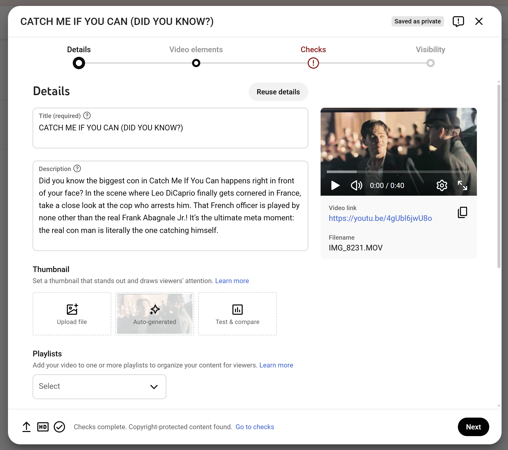
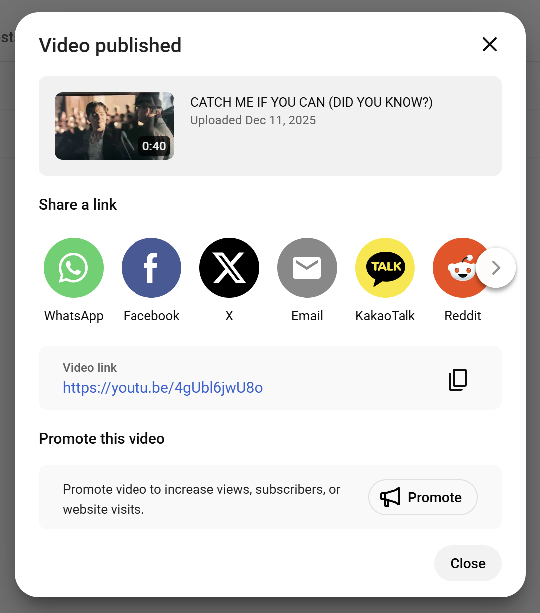
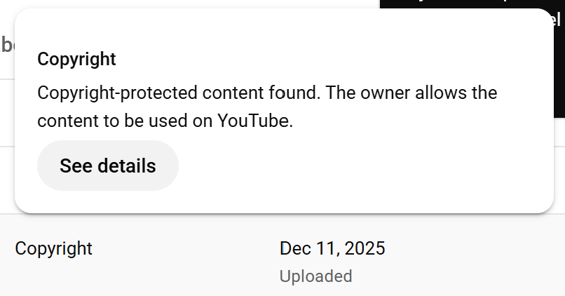

**Platform Action:**
- YouTube's Content ID identified copyrighted visual content
- Copyright holder policy: "The owner allows the content to be used on YouTube"
- Message: "Copyright-protected content found. The owner allows the content to be used on YouTube."
- No restrictions on visibility or availability
- Video remains fully published

### Key Observations

1. **Speed of Detection:** Both videos were flagged by Content ID during the upload process, before publication was complete. This demonstrates the real-time scanning capability of YouTube's automated system.

2. **Different Outcomes Despite Detection:** Both videos contained copyrighted content and were detected, but the copyright holders chose different enforcement actions:
   - Music content → Geographic blocking
   - Film content with commentary → Allowed to remain

3. **Transformation Matters:** The commentary video's educational purpose and added analysis likely influenced the copyright holder's decision to allow the content, though YouTube's system still flagged it for the owner to decide.

4. **No Channel Penalties:** Neither upload resulted in a copyright strike, as both were handled through Content ID claims rather than DMCA takedowns.

# Task 3: AI-Generated Content Investigation

## Experiment 1: Direct Reference to Copyrighted Character

### Description
Generated an image using Google Gemini with a prompt directly referencing a copyrighted Disney character. The AI successfully generated an image depicting the character in a novel context.

**AI Tool:** Google Gemini (Nano Banana Pro)  
**Prompt:** "Mickey Mouse in a spaceship"  
**Content Type:** AI-generated static image converted to 10-second video  
**Upload Time:** Dec 11, 2025  

### AI Generation

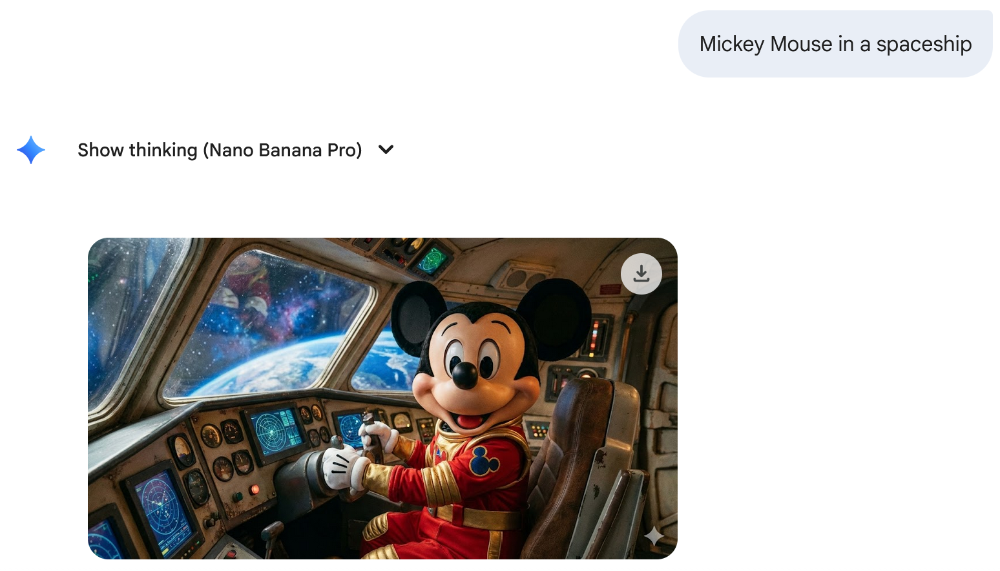

**AI Tool Response:** Despite the direct reference to a copyrighted character, Gemini generated an image showing Mickey Mouse in a detailed spaceship interior with space visible through windows. The character's distinctive features (circular ears, facial structure, clothing) were clearly recognizable.

### YouTube Upload Results

**Detection:** Immediate (checked during upload process)

**Outcome:** No copyright issues detected
- Content ID performed automatic check
- Result: "No issues found"
- No restrictions or claims applied
- Video fully published and accessible

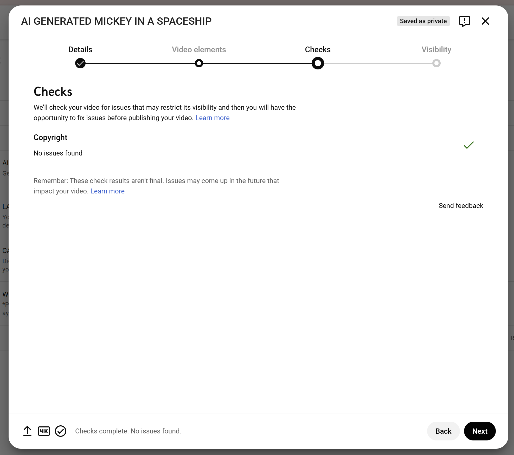

**Platform Action:**
- YouTube's automated copyright check completed successfully
- Message: "Checks complete. No issues found."
- No Content ID match detected
- Video allowed without any restrictions

---

## Experiment 2: Original AI-Generated Content (Control)

### Description
Generated a completely original image using Google Gemini with no references to copyrighted material. This serves as a baseline comparison for AI-generated content without copyright concerns.

**AI Tool:** Google Gemini (Nano Banana Pro)  
**Prompt:** "A friendly robot in a forest"  
**Content Type:** AI-generated static image converted to 16-second video  
**Upload Time:** Dec 11, 2025  

### AI Generation

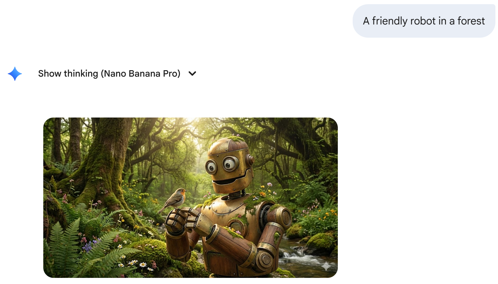

**AI Tool Response:** Gemini generated an original image of a stylized brass/copper robot sitting peacefully in a lush forest setting with a bird perched on its hand. The image contained no recognizable copyrighted elements.

### YouTube Upload Results

**Detection:** Immediate (checked during upload process)

**Outcome:** No copyright issues detected
- Content ID performed automatic check
- Result: "No issues found"
- No restrictions or claims applied
- Video fully published and accessible

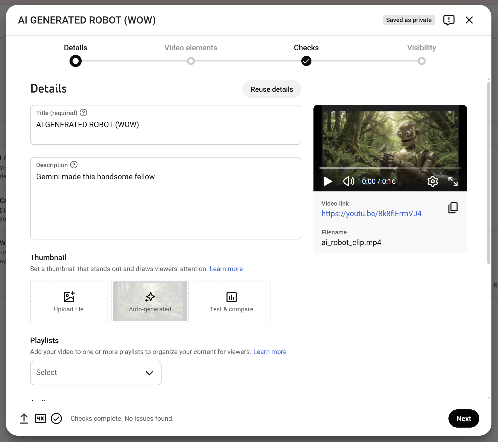
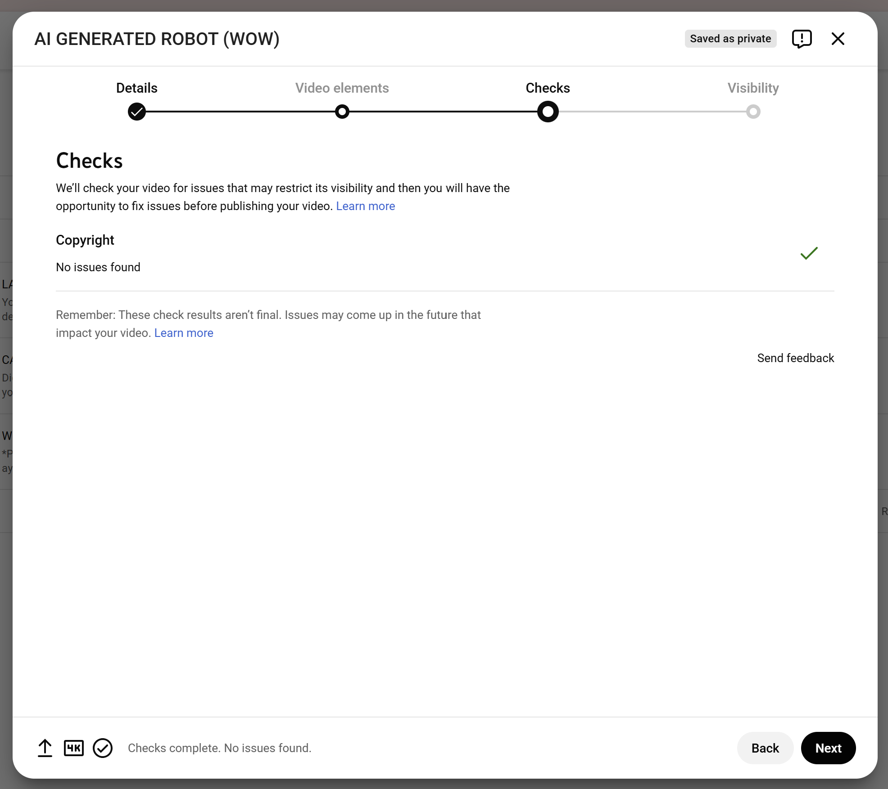

**Platform Action:**
- YouTube's automated copyright check completed successfully
- Message: "Checks complete. No issues found."
- No Content ID match detected
- Video allowed without any restrictions

### Both Videos Published

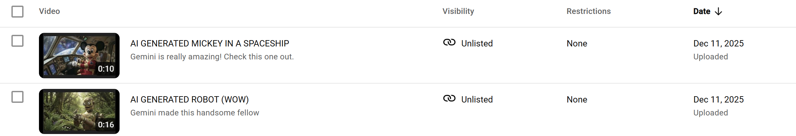

---

## Research Findings: AI Copyright and Ownership

### Google Gemini Terms of Service - Copyright

According to Google's Generative AI Prohibited Use Policy and Terms of Service:

**User Rights:**
- Users retain ownership of their prompts and inputs
- Users are granted rights to AI-generated outputs
- Google does not claim ownership of generated content

**Copyright Implications:**
- AI-generated content may not be copyrightable under current U.S. law (requires human authorship)
- Users are responsible for ensuring their prompts don't infringe on others' IP
- Users assume liability for how they use AI-generated content

**Training Data:**
- Google's models are trained on various data sources
- The company claims to respect intellectual property rights
- Specific training data sources are not publicly disclosed

### YouTube's Policy on AI-Generated Content

**Current Policy (as of Dec 2025):**
- YouTube does not have separate content policies specifically for AI-generated material
- AI content is subject to the same copyright, community guidelines, and content policies as human-created content
- Creators must disclose when realistic content is AI-generated or altered
- Content ID scans AI-generated videos the same way as traditionally created content

### Copyright Ownership Analysis

**Who owns AI-generated content?**

The legal landscape remains unsettled, but current understanding suggests:

1. **The AI Company (Google/Gemini):** Typically disclaims ownership but retains license to use content for improvement
2. **The User (Prompter):** Granted broad usage rights by most AI tools, but may not have full copyright protection
3. **Training Data Creators:** Unclear if they have residual rights when their work influences AI outputs
4. **Public Domain/No One:** Current U.S. Copyright Office position is that AI-generated content lacks human authorship required for copyright protection

### Key Observations

1. **Content ID Does Not Detect AI-Generated Character Likenesses:** Despite creating a recognizable depiction of Mickey Mouse (a heavily protected Disney character), YouTube's Content ID system did not flag the content. This suggests current automated systems are trained primarily on existing copyrighted works, not visual similarity to characters.

2. **Visual Similarity vs. Direct Copy:** Content ID appears to distinguish between:
   - Direct copies of existing copyrighted video/audio (flagged immediately)
   - New visual depictions that resemble copyrighted characters (not flagged)

3. **Copyright Enforcement Gap:** There is currently a significant gap between:
   - Legal rights (Disney owns Mickey Mouse trademark and character design)
   - Platform detection (YouTube's system doesn't catch AI-generated depictions)
   - Actual enforcement (no manual review or takedown for AI character depictions)

4. **AI Content Treatment:** Both AI-generated videos (copyrighted character and original content) were treated identically by YouTube's systems, receiving no flags or restrictions. This suggests platforms have not yet developed specialized detection for AI-generated content that may infringe on character rights or trademarks.

# Task 4: Legal Analysis

## Fair Use Four-Factor Analysis

Under U.S. copyright law (17 U.S.C. § 107), fair use is determined by evaluating four factors. Below is an analysis of how each experiment in Task 2 performs under these factors.

### Experiment 1: Raw Copyrighted Clip (Burna Boy - "Last Last")

| Factor | Analysis | Assessment |
|--------|----------|------------|
| **1. Purpose and Character of Use** | The clip was uploaded without any transformation, commentary, criticism, or educational context. It was purely reproductive—presenting the copyrighted work as-is. The use was non-commercial (no monetization attempted), but lack of transformation weighs heavily against fair use. There was no new expression, meaning, or message added. | **Strongly Against Fair Use** |
| **2. Nature of Copyrighted Work** | Music is a highly creative work, as opposed to factual or informational content. Creative works receive stronger copyright protection under fair use analysis. Additionally, published commercial music is closer to the core of copyright protection than unpublished or documentary works. | **Against Fair Use** |
| **3. Amount and Substantiality** | While only 16 seconds of a ~3-minute song was used (~9% by time), the clip included the recognizable hook and chorus—the most distinctive and commercially valuable part of the song. Using the "heart" of a work weighs against fair use even if the absolute amount is small. | **Against Fair Use** |
| **4. Effect on Market** | A 16-second clip is unlikely to substitute for the full song in most contexts. However, streaming services and social media have made short clips increasingly valuable for promotion and engagement. The copyright holder's choice to block (rather than monetize) suggests they believe such uses could harm their market or licensing opportunities. | **Moderately Against Fair Use** |

**Overall Fair Use Assessment:** **Not Fair Use**

This use would almost certainly fail a fair use defense. The lack of transformation is fatal to the claim, and all four factors weigh against fair use. The outcome (geographic blocking by copyright holder) aligns with what copyright law would likely support.

---

### Experiment 2: Commentary/Educational Use (Catch Me If You Can)

| Factor | Analysis | Assessment |
|--------|----------|------------|
| **1. Purpose and Character of Use** | The video added substantial transformative commentary—specifically, educational analysis pointing out that the actor playing the French police officer is the real Frank Abagnale Jr. This meta-commentary about the film's production adds new meaning and expression not present in the original. The purpose was educational/critical (classic fair use categories). Use was non-commercial. | **Strongly Favors Fair Use** |
| **2. Nature of Copyrighted Work** | The work is a creative fictional film, which typically receives strong copyright protection. However, criticism and commentary on creative works are explicitly protected fair use purposes. This factor is neutral when dealing with transformative criticism of published creative works. | **Neutral** |
| **3. Amount and Substantiality** | 40 seconds from a 141-minute film represents approximately 0.47% of the total work. The clip showed a specific scene necessary to illustrate the educational point being made. The amount used was reasonable and limited to what was necessary for the commentary. Did not use the "heart" of the work—this is not a climactic or commercially central scene. | **Favors Fair Use** |
| **4. Effect on Market** | The transformative commentary is unlikely to serve as a market substitute for the film. Viewers watching this educational clip would not consider their need to watch "Catch Me If You Can" satisfied. In fact, it might serve as promotion by increasing interest. The copyright holder's decision to allow (rather than block) the content suggests they recognize minimal market harm. | **Favors Fair Use** |

**Overall Fair Use Assessment:** **Likely Fair Use**

This use has a strong fair use argument. The transformative educational commentary, limited use of material, and minimal market impact all support fair use. Three of four factors favor the use. However, the copyright holder's decision to claim (but not block) suggests they're exercising their right to benefit from the content without acknowledging fair use—which is their prerogative under current platform policies.

**Important Note:** Even strong fair use cases receive Content ID claims because the system detects matching content mechanically, without evaluating context. The copyright holder then decides whether to enforce, and many choose to claim revenue even on likely fair uses.

---

## Gap Analysis: Law vs. Policy vs. Practice

This section examines discrepancies between what copyright law allows (legal theory), what YouTube's policies claim to do (stated policy), and what actually occurred (observed practice).

### Gap 1: Fair Use Evaluation

**Legal Theory:**
Under copyright law, fair use is an affirmative defense that should be evaluated on a case-by-case basis considering all four factors. Transformative educational commentary like Experiment 2 typically qualifies as fair use. Courts have repeatedly held that criticism, commentary, and educational uses are favored categories (see *Campbell v. Acuff-Rose Music, Inc.*, 510 U.S. 569).

**Platform Policy:**
YouTube's Content ID system is automated and detects copyrighted content without evaluating fair use. YouTube explicitly states that Content ID "is not designed to evaluate fair use" and places the burden on copyright holders to decide whether to claim content. Their policy documentation acknowledges fair use exists but provides no automatic protection for it.

**Actual Enforcement:**
Both videos were flagged immediately by Content ID, regardless of transformation. The commentary video—despite having a strong fair use argument—received a Content ID claim and only remained accessible because the copyright holder chose to allow it. YouTube's system provided no fair use protection; the outcome depended entirely on the copyright holder's policy settings.

**The Gap:**
Copyright law provides an affirmative defense (fair use) that should protect certain uses. YouTube's system bypasses this by:
1. Detecting all uses of copyrighted content
2. Allowing copyright holders to claim even transformative content
3. Placing burden on creators to dispute claims
4. Leaving final decisions to copyright holders, not courts

This means creators making legitimate fair use must either accept claims on their content or navigate a dispute process where non-lawyer copyright holders judge their fair use argument. Legal rights exist on paper but require creator initiative and copyright holder cooperation to exercise.

### Gap 2: Automated Detection of Derivative Works

**Legal Theory:**
Copyright law protects both exact reproductions AND derivative works (17 U.S.C. § 106). Creating an unauthorized derivative work—such as a new image of Mickey Mouse—is copyright infringement, even if it doesn't copy any existing Disney image file. Disney owns the character design, not just specific images.

**Platform Policy:**
YouTube states that Content ID "compares uploaded videos to a database of files submitted by copyright owners." The system is designed to detect matching content based on digital fingerprinting of existing files. Platform policies do not address how AI-generated content depicting copyrighted characters should be handled.

**Actual Enforcement:**
The AI-generated Mickey Mouse image passed all copyright checks with "No issues found," despite depicting a recognizable copyrighted character. Content ID flagged the direct video clip (Experiment 1) but missed the AI-generated character depiction (Task 3, Experiment 1).

**The Gap:**
Copyright law's protection is broader than YouTube's enforcement capability. The platform can only detect what it has been trained to detect—copies of existing files. This creates a significant blind spot:
- Traditional infringement (copying files) → Detected immediately
- Derivative works (new depictions of characters) → Not detected
- AI-generated copyrighted characters → No protection at all

This gap will grow as AI tools make it easier to create new depictions of copyrighted characters without copying any existing file.

### Gap 3: Copyright Holder Discretion vs. Legal Standards

**Legal Theory:**
Copyright provides exclusive rights, but those rights are balanced against fair use, first sale doctrine, and other limitations. Copyright holders cannot legally prevent all uses—some uses are explicitly protected by law.

**Platform Policy:**
YouTube grants Content ID partners discretionary control over matching content. Partners can choose to block, monetize, or track—regardless of whether the use might qualify as fair use. YouTube's policy states: "Content ID is available to copyright owners who meet specific criteria" and allows them to set their preferred enforcement action.

**Actual Enforcement:**
- Burna Boy's rights holder → Chose to block in certain territories
- Paramount (Catch Me If You Can) → Chose to allow with claim
- Both decisions were made unilaterally by copyright holders through automated policy settings

**The Gap:**
The platform empowers copyright holders to act as judge and jury. Even if a use qualifies as fair use under legal analysis, the copyright holder can:
1. Claim the video and take revenue
2. Block it in certain territories
3. Block it worldwide
4. Only reverse their decision if the creator disputes and they agree

This system prioritizes copyright holder preferences over legal standards, creating a "copyright maximalist" environment where legal rights must be actively fought for rather than automatically respected.

### Gap 4: Claim vs. Strike Distinction

**Legal Theory:**
Under the DMCA, copyright holders can issue takedown notices for infringing content. False DMCA notices can result in legal penalties under 17 U.S.C. § 512(f). The law creates a formal process with legal consequences.

**Platform Policy:**
YouTube distinguishes between Content ID claims (automated, no penalty) and copyright strikes (DMCA takedowns, count toward termination). The vast majority of enforcement happens through claims, which don't penalize creators but do allow copyright holders to claim revenue.

**Actual Enforcement:**
Both experiments received Content ID claims, not strikes. Neither impacted channel standing. The commentary video remained accessible despite being claimed.

**The Gap:**
This is actually a gap that favors creators. YouTube's two-tier system provides more flexibility than strict DMCA enforcement:
- **Legal Process:** Infringement → DMCA takedown → potential legal action
- **Platform Process:** Infringement → Content ID claim → optional dispute → possible appeal

YouTube's system allows copyright holders to monetize rather than remove potentially fair uses, creating a middle ground that benefits both parties. However, this also means creators may accept claims on fair use content rather than fight, effectively waiving their legal rights for convenience.

### Gap 5: AI Content Ownership and Training Data Rights

**Legal Theory:**
Current copyright law requires human authorship for protection. The U.S. Copyright Office has stated that AI-generated content cannot be copyrighted because it lacks human creative input. Additionally, questions remain about whether training AI on copyrighted works constitutes infringement.

**Platform Policy:**
YouTube has no specific policy for AI-generated content as of December 2025. AI-generated videos are treated identically to human-created content in Content ID scanning. Disclosure requirements exist for realistic content but don't affect copyright enforcement.

**Actual Enforcement:**
Both AI-generated videos (Mickey Mouse and robot) passed copyright checks identically, despite one depicting a copyrighted character. The platform made no distinction between:
- Original AI content (robot) 
- AI content depicting copyrighted IP (Mickey)

**The Gap:**
Three emerging questions with no clear answers:

1. **Ownership:** Who owns AI-generated Mickey Mouse image? The prompter (me)? Google/Gemini? Disney (character rights)? Public domain (no human authorship)? No clear legal framework exists.

2. **Enforcement:** Current systems can't detect AI-generated IP infringement. As AI improves, the volume of derivative works will explode, but platforms have no mechanism to address them.

3. **Training Data:** If AI was trained on copyrighted Disney images to learn what Mickey Mouse looks like, did that training constitute infringement? Courts haven't definitively ruled on this question.

This represents a fundamental gap between rapidly evolving technology and slowly adapting legal frameworks.

---

## Summary: The Three-Layer Reality

**Layer 1 - Legal Rights (What the law says):**
- Fair use protects transformative, educational, and critical uses
- Derivative works are protected by copyright
- Copyright holders cannot prevent legally protected uses

**Layer 2 - Platform Policy (What YouTube says):**
- Content ID detects all matches, regardless of fair use
- Copyright holders control enforcement through pre-set policies
- Creators can dispute, but holders make final decision (outside of legal appeals)
- Strikes are reserved for DMCA takedowns

**Layer 3 - Practical Reality (What actually happens):**
- All copyrighted content is claimed, fair use or not
- Transformative content remains only if copyright holder allows it
- AI-generated derivative works escape detection entirely
- Most creators accept claims rather than dispute
- Legal rights exist but require active assertion through platform processes

The result is a system where legal copyright principles are filtered through automated detection and copyright holder discretion, creating outcomes that may not align with what courts would decide. Fair use exists in theory but must be fought for in practice. New technologies (AI) exploit gaps in detection systems, and platform efficiency is prioritized over legal precision.

# Appendix
1. Catch me if You Can commentary (uploaded 12/11 12:01pm, flagged immediately): https://youtu.be/4gUbl6jwU8o
2. Last Last raw audio (uploaded 12/11 12:21pm, flagged immediately): https://youtu.be/klJE_XR0cOg
3. AI Generated Robot (uploaded 12/11 12:51pm, never flagged): https://youtu.be/8k8fiErmVJ4
4. AI Generated Mickey in a Spaceship (uploaded 12/11 12:57pm, never flagged): https://youtu.be/Nq8bFVGfK2g
